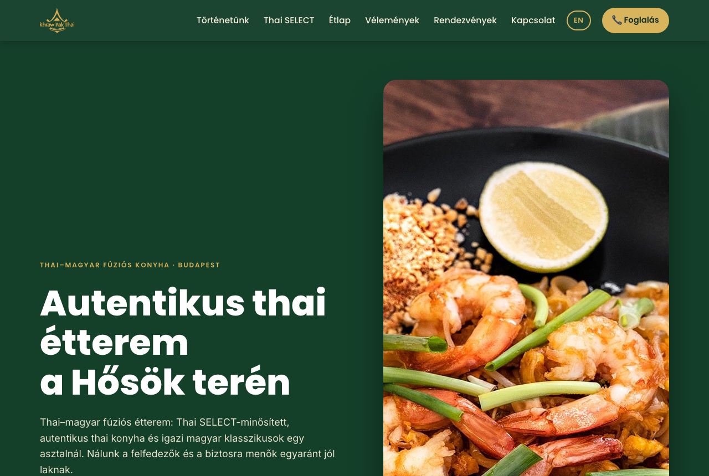

<div align="center">

# Khraw Pak Thai — Restaurant Website

**Live at [khrawpakthai.com](https://khrawpakthai.com)** · Hungarian at `/`, English at `/en/`

[](https://github.com/somogyif/khraw-pak-thai/actions/workflows/audit.yml)

Static HTML/CSS/JS · No framework · No build step · Zero dependencies



</div>

---

## What this is

The website of **Khraw Pak Thai**, a Thai–Hungarian fusion restaurant next to Heroes' Square in Budapest — a business I co-founded. It holds the Thai SELECT certification from the Royal Thai Government and sits in one of the city's busiest tourist locations.

It replaced a page-builder one-pager whose browser title was, literally, the placeholder **"Weboldal HU"** ("Website HU"). That string was what appeared in Google results.

This repository is the whole thing: the site, the tests that gate it, the CI that runs them, and the working rules that keep future changes from drifting.

**How it was built:** I directed [Claude Code](https://claude.com/claude-code) to do the implementation. I owned the brand positioning, every content decision, the native-Hungarian copy quality control, and every architecture call — including the two judgement calls documented below, both of which reversed something the code was already doing. The AI wrote code fast; deciding what was correct was not delegated.

---

## The audit

I started by auditing the old site. Each finding is listed with what it actually cost the business, because "no structured data" is not an argument a restaurant owner can act on.

| What was broken | What it cost |
|---|---|
| Page title was the placeholder `Weboldal HU` | This was the clickable headline in Google results. A person searching "thai étterem Budapest" saw a string that told them nothing and looked abandoned. |
| No menu on the site — the "Menu" link opened an external Canva design | The menu is the single most-wanted thing on a restaurant site. It sat on a third-party domain, so Google never indexed a single dish name, and on mobile it meant leaving the site to pinch-zoom a PDF-like page. |
| Opening hours read "Coming soon" | One of the top three questions a guest has. Absent hours read as "possibly closed down". |
| Phone number was plain text | On mobile it could not be tapped. Every booking required the guest to memorise or copy a number — friction at exactly the moment of intent. |
| No ordering or booking path | The site had no conversion action at all. Traffic arrived and left. |
| No structured data, no semantic headings, 13 images without alt text, broken social preview | Google had no machine-readable facts about the business, and links shared to Messenger or Facebook rendered as a bare URL with no image — which is most of how a local restaurant actually spreads. |
| Several seconds of blank screen on load; default Canva favicon | Mobile visitors on 4G saw nothing at first. The tab carried another company's branding. |

The design was fine. The site simply did not answer the questions guests arrive with.

---

## What was built

**Bilingual on two indexable URLs.** Hungarian at `/`, English at `/en/`, with reciprocal `hreflang` (hu / en / x-default) and self-referencing canonicals on both, mirrored in the sitemap. The language toggle is a real link between the two URLs, not a client-side swap — the previous approach meant Google reliably indexed only the Hungarian, while English-speaking tourists near Heroes' Square are a core audience.

**The English page is generated, not maintained by hand.** [`scripts/build-en.py`](scripts/build-en.py) reads the Hungarian source, lifts every `data-en` attribute into the visible text, drops the attribute, rewrites asset paths for the subdirectory, and rebuilds the FAQ structured data from the translated questions. There is one source of truth, so the two languages cannot drift. CI fails if the generated page is stale (`build-en.py --check`).

**The full menu, on the page.** Extracted from a 20-page bilingual print PDF into a category-tabbed HTML menu with prices — Thai, Hungarian, sides, desserts, drinks. Multi-protein dishes were reordered ascending by price (vegetable → chicken → pork → beef → shrimp) so the columns read cleanly.

**60+ dish photos, converted from print to web.** The PDF's images were CMYK, which renders with inverted colours in a browser. They were converted to sRGB, resized and optimised. Thumbnails are lazy-loaded and attached selectively — only to the less familiar Thai dishes, where a photo does the reassuring, rather than to every line, which would have bloated the page for no gain.

**Live "open now / closed" indicator**, computed in Budapest time regardless of the visitor's timezone, in both languages.

**Structured data:** `Restaurant` (address, geo, hours, price range, cuisines, award), `FAQPage`, Open Graph and Twitter cards with a branded share image.

**Continuous deployment:** GitHub → Netlify. Every push to `main` deploys. `netlify.toml` carries the security headers, cache policy and publish directory, so the configuration lives with the code.

---

## Two decisions worth explaining

### The DNS cutover

Pointing the domain at the new host meant editing DNS at a registrar where the restaurant's **email also lived** — Google Workspace MX records, SPF, and a full set of `mail`, `webmail`, `smtp`, `imap`, `pop3` and `autodiscover` entries.

Netlify offers to take over the domain's nameservers, which is the path of least resistance and the one that breaks email. Handing DNS to Netlify would have required rebuilding every mail record by hand, with the restaurant's inbox down for as long as it took to get wrong and fix.

Instead: **DNS stayed at the existing provider**, and only the two web records changed — the apex and `www` A records repointed to Netlify's load balancer. Every mail record was left untouched. Propagation was verified with `dig` against both Google and Cloudflare resolvers before declaring it done, and HTTPS was confirmed end to end afterwards.

Zero minutes of email downtime. The boring option was the correct one.

### Removing the review automation

I built a scheduled GitHub Action that pulled fresh Google reviews through the Places API, filtered them, and published them to the site. It worked: it ran, filtered correctly, committed, and deployed.

Then I checked the terms properly. Google Maps Platform Terms §3.2.3(a)(iii) name **"user reviews"** explicitly among the content that must not be copied or stored, and the Places API Service Specific Terms permit caching only `place_id` and coordinates. Nothing permits caching review text.

So it came out — script deleted, workflow disabled, and the reason written into [`CLAUDE.md`](CLAUDE.md) as a standing rule so nobody rebuilds it in six months. The review block stays, maintained by hand with attribution. If the restaurant ever wants automation, the sanctioned route is the Google Business Profile API, which is a business accessing its own reviews under different terms.

Shipping something that works is not the same as shipping something you are allowed to run. I would rather find that out myself than have a client find out later.

---

## Quality

- **Two test layers, both in CI.** [`tests/audit.py`](tests/audit.py) — **74 checks** reading the files as text: structure and broken anchors, every referenced image existing and carrying alt text, JSON-LD validity, phone-number consistency, form integrity, hreflang reciprocity, repo-wide secret scanning. Dependency-free, runs in a second, wired into the pre-commit hook.
- **[`tests/render-check.py`](tests/render-check.py) — 62 checks in a real browser**, because the first layer cannot see rendering bugs by construction. Seven of them lived here for three weeks with correct HTML source: the English page relabelled itself Hungarian at runtime, 36 alt texts stayed Hungarian, a form field vanished from the generated page, the menu photos were unreachable by keyboard, and a sanitiser silently ate the privacy-notice link. This layer asserts on the rendered DOM — document language, leftover Hungarian in attributes, links that are actually links, keyboard reach and focus return, zero cookies, no horizontal overflow at 320/390/1280. It runs against the live site weekly, which is what catches a bad deploy rather than bad code.
- **Pre-commit gate** ([`.githooks/pre-commit`](.githooks/pre-commit)) — blocks any commit carrying a secret or failing the audit. Verified against a planted fake API key.
- **Weekly smoke test** ([`tests/live-check.sh`](tests/live-check.sh)) against the deployed site: status, redirects, security headers, sitemap, robots, favicon.
- **Quarterly agent sweep** ([`.claude/workflows/site-sweep.js`](.claude/workflows/site-sweep.js)) for what tests cannot see by construction — external listings drifting from reality, a statute changing, copy that reads like a translation. Five independent lenses, and every finding is put in front of a skeptic instructed to refute it before it reaches anyone. Not weekly: measured across three external reviews, three models produced roughly ten real findings and six false ones, and each false one cost an afternoon. Every confirmed finding becomes a check in one of the two layers above.
- **Self-hosted fonts** — 14 WOFF2 files served from our own domain. A 2022 Munich ruling (LG München I, 3 O 17493/20) held that passing a visitor's IP to Google via Google Fonts breaches the GDPR precisely because self-hosting is available. This is an EU business, so the CDN had to go. CSP tightened to `style-src 'self'; font-src 'self'` afterwards.
- **Accessibility** — contrast measured across the whole palette (worst case 5.9:1 against a 4.5 requirement), visible `:focus-visible` rings for keyboard navigation, intrinsic `width`/`height` on every image to prevent layout shift.
- **Security posture** — the site is static by design: no database, no accounts, no payments, no secrets in the codebase, zero npm dependencies in what ships. There is no runtime templating at all: both pages are generated at build time, nothing assigns `innerHTML`, and the audit fails on any attempt to reintroduce it. The site stores nothing in a visitor's browser — no cookies, no local storage.
- **Working rules** ([`CLAUDE.md`](CLAUDE.md)) — architecture decisions and hard constraints recorded so future changes inherit them instead of rediscovering them.

---

## Repository layout

```
site/                  the deployed site (Netlify publish directory)
  index.html           Hungarian — the source of truth for both languages
  en/index.html        English — generated, do not edit by hand
  404.html             branded, bilingual
  assets/img/          14 photos + 48 menu thumbnails
  assets/fonts/        14 self-hosted WOFF2 files
scripts/build-en.py    generates the English page from the Hungarian
tests/audit.py         74 checks, no dependencies
tests/render-check.py  62 checks in a real browser
tests/live-check.sh    smoke test against production
.githooks/pre-commit   secret scan + audit before every commit
netlify.toml           headers, caching, publish directory
CLAUDE.md              working rules for this repository
CASE-STUDY.md          the full story, written for a general audience
```

## Running it locally

```bash
git config core.hooksPath .githooks   # enable the pre-commit gate, once

python3 -m http.server 8765 -d site   # serve
python3 tests/audit.py                # 74 text checks, no dependencies
python3 tests/render-check.py         # 62 browser checks (needs playwright)
python3 scripts/build-en.py           # regenerate the English page
bash tests/live-check.sh              # smoke-test production
```

---

*Full narrative in [`CASE-STUDY.md`](CASE-STUDY.md) · Detailed technical overview in [`PROJECT-OVERVIEW.md`](PROJECT-OVERVIEW.md) · Hungarian summary in [`PROJEKT-OSSZEFOGLALO.md`](PROJEKT-OSSZEFOGLALO.md)*
